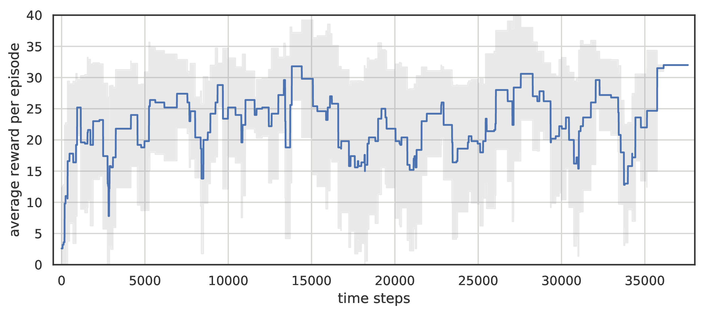

> Paper: [https://arxiv.org/pdf/2006.09950.pdf](https://arxiv.org/pdf/2006.09950.pdf)

# Idea

Model predicts future states of the environment and plans actions that will lead to positive reward.

Agent receives an image from the environment, which is parsed into a set of extracted objects. Then model learns a set of rules -- *schemas*, which reflect logical interconnection between objects' properties, actions and rewards. Each schema, as a logical AND function, predicts some binary property of the objects of certain type, using information about properties of other objects and actions from past observations.

It is possible to represent this interconnection as a factor graph. A variable node in this graph is either a property of some object, potentially achievable reward or action. Factors are schemas, that have input and output nodes. The edges indicate the presence of a causal relationship between the objects and events. An agent can find a node with a positive reward in future time layers of this graph and plan actions to reach it.

Each pixel of image is considered as entity.

# Learning

DSN model learns dynamics of the environment in terms of schema vectors and, from some point of view, represents both transition and reward functions of the environment.

During interaction with the environment agent stores unique transitions in replay buffer.
Using this data, MIP is solved to predict changes in states in self-supervised manner.

# Planning

The purpose of planning is to find a sequence of actions that will lead to positive reward.
The planning process consists of several stages:

- Forward pass builds factor graph of potentially reachable nodes;
- A set of target reward nodes are selected;
- Sequence of actions that will activate target node are planned.

# Experiments

The model was evaluated on the Atari Breakout game, highest possible reward for episode was 36. 

*Total reward per episode of DSN on standard Breakout. Averaged over 5 runs.*
{: style="width: 70%;" class="center-image"}

Agent did not managed to knock down completely all bricks in part of episodes, because after destroying some part of them to the top wall, it could not longer detect future reward and hence plan actions.

A distinctive feature of the DSN is transfer of the trained model to environments with similar dynamics.
We evaluated the model, trained in the previous experiment, on the same environment but with two balls.
Results of transfer without additional training show similar average score.

*DSN performance after zero-shot transfer. Averaged over 5 runs.*
{: style="width: 70%;" class="center-image"}

We compared DSN model to DQN. DQN needs significantly more time steps to reach equal performance.

*DQN performance on standard Breakout. Single run, rolling mean with window size = 5.*
{: style="width: 70%;" class="center-image"}

# Video of presentation

<iframe width="837" height="447" src="https://www.youtube.com/embed/tj9CMomLgYY" frameborder="0" allow="accelerometer; autoplay; encrypted-media; gyroscope; picture-in-picture" allowfullscreen></iframe>
